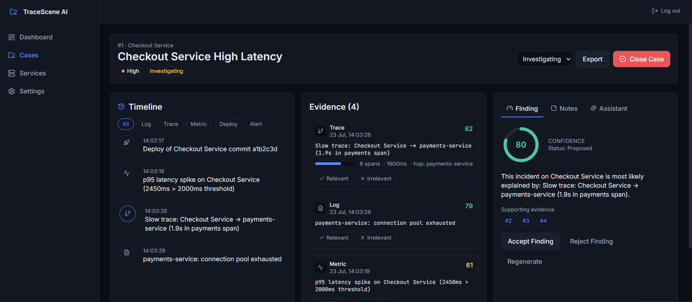
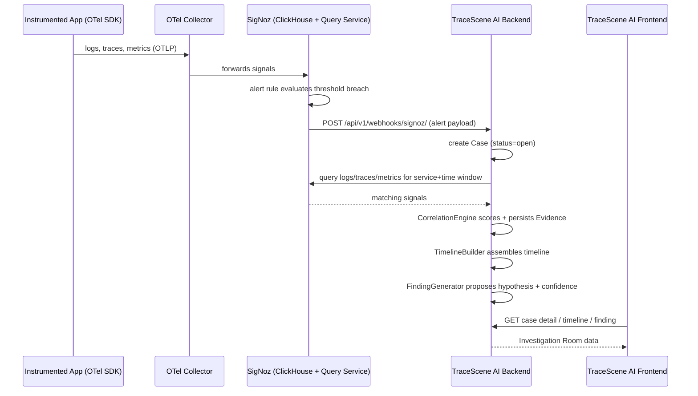

# TraceScene AI

**Turn telemetry into an investigation, not a wall of dashboards.**

## Problem / Solution

SigNoz (built on OpenTelemetry) gives engineers logs, traces, metrics, and alerts — but during a live incident, engineers still spend the first 15–30 minutes manually stitching these signals together across dashboards. TraceScene AI removes that manual stitching step: it wraps a SigNoz-instrumented system with an **Investigation Room**, where an incident is treated like a case file. Alerts become "leads," logs and traces become "evidence," correlated evidence becomes a "timeline," and the system proposes a "finding" with a transparent, explainable confidence score. TraceScene AI does not replace SigNoz — it's a reasoning and narrative layer on top of it.

## Screenshot

The signature screen is the **Investigation Room** (Case Detail): a three-column layout with a chronological Timeline on the left, scored Evidence in the center, and a tabbed Finding / Notes / AI Assistant panel on the right. Run the app locally (Quick Start below) to see it live — it's the best way to understand the product in under 60 seconds.


## Architecture



System diagram: **React (Vite) frontend** ↔ **Django REST Framework backend** (SQLite for MVP) ↔ **SigNoz** (ClickHouse + Query Service, OTel-native). The backend is the only thing that talks to SigNoz (via `integrations/signoz_client.py`), and is itself instrumented with OpenTelemetry (dogfooding).

## Features

- AI-assisted incident investigation
- Timeline-based event correlation
- Evidence management
- AI-generated findings with confidence score
- SigNoz integration
- Distributed tracing
- Application log analysis
- Investigation dashboard

## Tech stack

| Layer | Technology |
|---|---|
| Frontend | React 18, Vite, Tailwind CSS, React Router, lucide-react, axios |
| Backend | Django 5, Django REST Framework, django-filter, django-cors-headers |
| Database | SQLite (MVP) — Postgres-ready via `DATABASE_URL` |
| Observability | OpenTelemetry SDK (Python), SigNoz (ClickHouse-backed) |
| Testing | pytest + pytest-django (backend), Vitest + React Testing Library (frontend) |
| Infra | Docker Compose, GitHub Actions CI |

## Quick start

```bash
# 1. Backend
cd backend
python -m venv venv && source venv/bin/activate   # Windows: venv\Scripts\activate
pip install -r requirements.txt
cp .env.example .env
python manage.py migrate
python manage.py createsuperuser
python manage.py runserver      # http://localhost:8000

# 2. Frontend (new terminal)
cd frontend
npm install
cp .env.example .env
npm run dev                     # http://localhost:5173

# 3. Observability stack (new terminal, from repo root — optional but recommended)
docker compose -f docker-compose.signoz.yml up -d

# 4. Demo instrumented sample app (optional, new terminal)
cd demo-app && pip install -r requirements.txt && python app.py
```

**Note:** TraceScene AI works even without SigNoz running — `SigNozClient` falls back to realistic, deterministic demo evidence (logged loudly so it's never mistaken for real telemetry) so the correlation → timeline → finding pipeline is always demoable.

## Foundry Deployment

This repository includes:

- casting.yaml
- casting.yaml.lock

These files allow the SigNoz observability stack to be reproduced using Foundry.

Start the observability stack using:

```bash
foundryctl cast
docker compose up --build

## Demo Scenario

Generate sample telemetry by repeatedly calling the demo application's checkout endpoint.

Example:

```powershell
for ($i=0; $i -lt 20; $i++) {
    Invoke-WebRequest http://localhost:5001/checkout -UseBasicParsing | Out-Null
}
```

This generates traces and logs visible in SigNoz, which TraceScene AI uses during investigations..

## API overview

Full spec (all endpoints, request/response examples, and the correlation/scoring algorithms explained in prose) lives in [`docs/ARCHITECTURE.md`](docs/ARCHITECTURE.md). Base URL: `/api/v1/`, token auth (`Authorization: Token <key>`).

## Project structure

```
tracescene-ai/
├── backend/        # Django REST Framework API (see backend/config for settings)
├── frontend/        # React + Vite SPA
├── demo-app/         # Instrumented Flask sample service for the live demo
├── docs/              # ARCHITECTURE.md, PROJECT_DECISIONS.md, TROUBLESHOOTING.md
├── scripts/            # trigger_incident.sh
├── docker-compose.yml
├── docker-compose.signoz.yml
└── otel-collector-config.yaml
```

## Roadmap

Post-MVP: LLM-grounded AI Assistant with cited answers, full trace waterfall visualization, role-based access control, PDF/Markdown postmortem export, Slack/Teams incident bot, learned (ML-based) correlation scoring, cross-case pattern detection, multi-tenant SaaS packaging. See `docs/ARCHITECTURE.md` for details.

## License

MIT — see [LICENSE](LICENSE).
